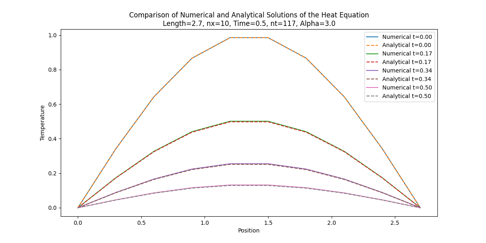
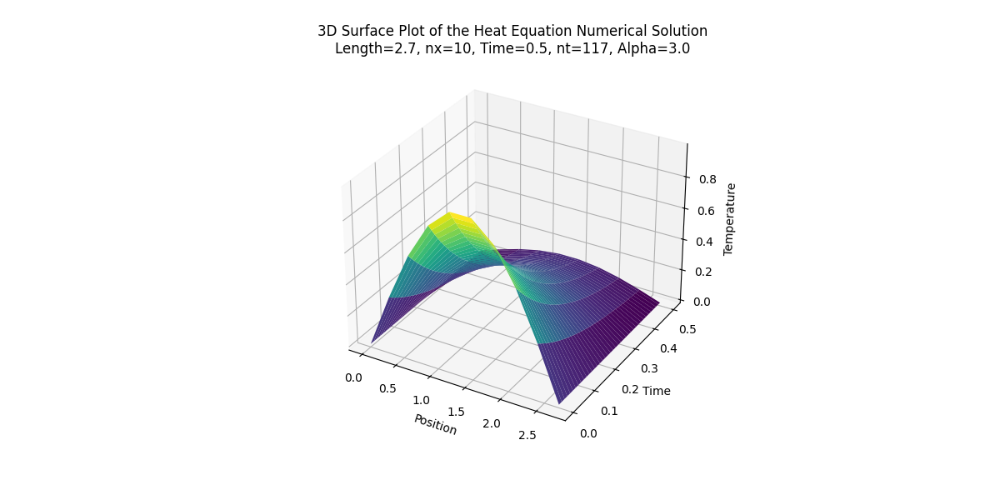
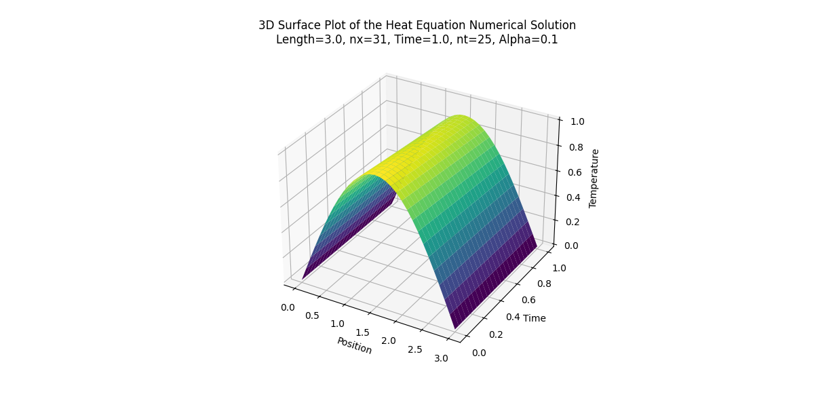

<h1>Heat equation solutions</h1>
The heat equation is a parabolic partial differential equation (PDE) that shows how heat changes over time in a solid medium.
In one dimension is expressed as:

$\frac{\partial w}{\partial t} = \alpha \frac{\partial^2 w}{\partial x^2}$

where $x$ and $t$ are the spatial and time coordinates, $u$ is the temperature at the point of coordinates $x$ and $\alpha$ is the coefficient of thermal diffusivity of the medium.

The program aims to examine the heat diffusion in a one-dimensional rod with fixed boundary conditions at both ends and an initial temperature distribution given by a sinusoidal function. The equation is solved numerically using the Crank-Nicolson method, an implicit finite difference method, and it is then compared with the analytical solution obtained with a Fourier sine series.\
The discretization of the heat equation using the Crank-Nicolson method is:

$-r w_{i+1}^{n+1} + (1 + 2r)w_i^{n+1} - r w_{i-1}^{n+1} = r w_{i+1}^n + (1 - 2r) w_i^n + r w_{i-1}^n$

with $r = \frac{\alpha \Delta t}{2(\Delta x)^2}$.\
The equation can also be written in matrix form as:

$w_{n+1} = A^{-1}Bw_n$

where $A$ and $B$ are the following tridiagonal matrices:

$$
A = \left[\begin{matrix}
1 & 0 & 0 & \cdots & 0 & 0\cr
-r & 1 + 2r & -r & \cdots & 0 & 0\cr
0 & -r & 1 + 2r & \cdots & 0 & 0\cr
\vdots & \vdots & \vdots & \ddots & \vdots & \vdots\cr
0 & 0 & 0 & \cdots & 1 + 2r & -r\cr
0 & 0 & 0 & \cdots & 0 & 1
\end{matrix}\right]
$$

$$
B = \left[\begin{matrix}
1 & 0 & 0 & \cdots & 0 & 0\cr
r & 1 - 2r & r & \cdots & 0 & 0\cr
0 & r & 1 - 2r & \cdots & 0 & 0\cr
\vdots & \vdots & \vdots & \ddots & \vdots & \vdots\cr
0 & 0 & 0 & \cdots & 1 - 2r & r\cr
0 & 0 & 0 & \cdots & 0 & 1
\end{matrix}\right]
$$

<h2>Structure of the project</h2>
To start the program the user needs to follow these steps:

1. Write the preferred parameters on the [configuration.txt](./configuration.txt) file and the local paths to save the final results.
2. Launch the [simulation.py](./simulation.py) which imports the selected parameters from the [configuration.py](./configuration.py) file using the ConfigParser library. It is then verified the presence of stable combinations of parameters, if not it is shown a ValueError, and the simulation ends. If there are stable combinations, the program calculates both the numerical and the analytical solution, saves them automatically in the data folder, and then shows the plots.

There are five blocks in this project:
* In the [configuration.txt](./configuration.txt) file there are all the parameters used in the [simulation.py](./simulation.py). For both nx_values and nt_values there is a list of different parameters so that it is possible to verify more than one combination per execution. There are also local paths for saving the solutions array.
* In the [function.py](./function.py) file there are all the functions used to calculate the solutions of the heat equation.
* In the [test.py](./test.py) file all the functions are tested so that all of them work properly as well as the program itself.
* In the [plot.py](./plot.py) file there are two functions, one that plots the comparison between the numerical and the analytical solution of the heat equation and the other that shows the surface plot of the numerical solution through time.
* In the [simulation.py](./simulation.py) file there is the main part of the code, where the numerical and analytical solutions  matrices are calculated, saved on the appropriate path, and then plotted.

Some examples of the obtainable results:

